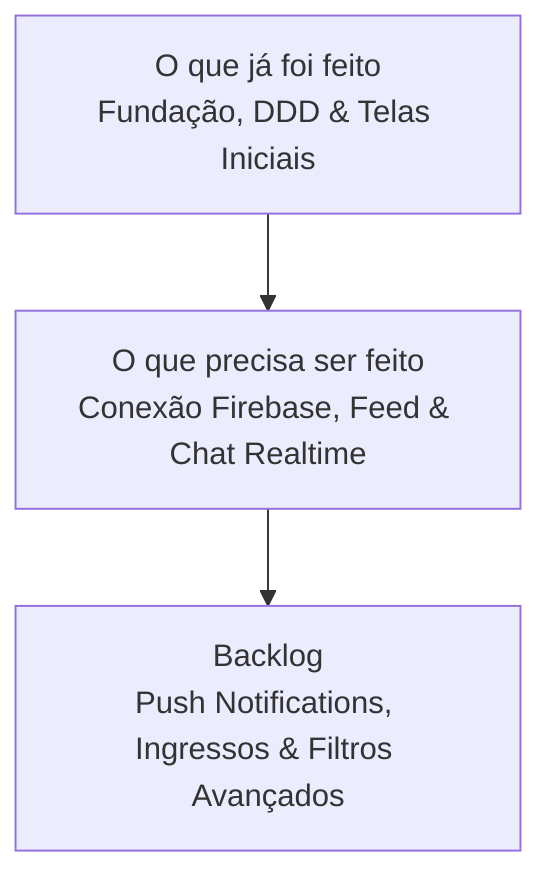

# Roadmap de Desenvolvimento do MVP - BR Connect (BRC)

> [!NOTE]
> Este documento estabelece o planejamento estratégico e técnico para a construção do Produto Mínimo Viável (MVP) do **BR Connect (BRC)**. O objetivo é priorizar funcionalidades essenciais de conexão, eventos e engajamento, utilizando a arquitetura DDD e as tecnologias descritas em [ARCHITECTURE.md](./ARCHITECTURE.md), focando puramente nas prioridades de escopo sem engessamento de prazos ou sprints.

## 1. Estratégia do MVP e Objetivos Principais

O foco central do MVP é validar a proposta de valor central do BR Connect com o menor esforço de desenvolvimento possível, assegurando alta qualidade de código, performance nativa e arquitetura pronta para escalabilidade futura.

---

## 2. Detalhamento do Roadmap por Status de Escopo

As frentes de trabalho estão organizadas pelo status atual de implementação, respeitando a divisão de camadas do projeto (`src/`: `app`, `libs`, `presentation`, `shared`) e a infraestrutura de backend baseada em Firebase configurada no `package.json`.

### ✅ O que já foi feito (Concluído)

> [!IMPORTANT]
> A base estrutural, arquitetura em Domain-Driven Design (DDD) e grande parte dos componentes visuais já foram estabelecidos para garantir um desenvolvimento padronizado e escalável.

- **Arquitetura & Fundação (DDD):**
  - Projeto configurado com React Native 0.83, TypeScript, NativeWind 4.2 e ícones Lucide.
  - Divisão clara em camadas no diretório `src/`: `app`, `libs`, `presentation` e `shared`.
  - Configuração da estrutura de navegação (`src/app/navigation`), provedores (`src/app/providers`), contextos (`src/app/contexts`) e estilos globais (`global.css`).
- **Infraestrutura & Backend (`src/libs/infrastructure`):**
  - Estruturação inicial da conexão com Firebase em `src/libs/infrastructure/firebase`.
  - Módulos base de logger (`src/libs/infrastructure/logger`) e armazenamento local (`src/libs/infrastructure/storage`).
- **Camada de Apresentação (Telas & UI em `src/presentation`):**
  - **Autenticação (`auth`):** Telas ricas de Boas-vindas (`Welcome.tsx`), autenticação base (`Auth.tsx`) e Cadastro (`Register.tsx`). Estruturas iniciais para Login e Recuperação de Senha.
  - **Eventos (`events`):** Componente robusto de interface de eventos implementado (`Events.tsx`).
  - **Chats (`chats`):** Telas visuais para a lista de conversas (`Chats.tsx`) e salas de chat privado (`PrivateChatScreen.tsx`).
  - **Configurações & Administração (`settings`):** Views de gestão de permissões (`RBAC.tsx`), depuração do Firebase (`Firebase.tsx`), formulário de feedback (`FeedbackForm.tsx`) e base de configurações (`Settings.tsx`).
  - **Navegação:** Placeholders estruturais prontos para Perfil (`Profile.tsx`), Explorar (`Explore.tsx`) e Introdução (`introduction`).
- **Documentação Base:**
  - Definições arquiteturais em `ARCHITECTURE.md`, guia de instalação em `INSTALL.md` e o `README.md` principal bem estruturados.

---

### 🏗️ O que precisa ser feito (Foco do MVP)

> [!TIP]
> O foco imediato do MVP consiste em plugar as interfaces existentes às regras de negócio e ao Firebase, tornando o aplicativo funcional de ponta a ponta.

- **Conclusão do Fluxo de Autenticação e Domínio (`auth` & `user`):**
  - Finalizar a integração funcional e UI das telas de `Login.tsx` e `ForgotPassword.tsx` com o Firebase Authentication.
  - Conectar as validações de esquema (`zod`) e persistência de sessão (`AsyncStorage`) aos casos de uso de domínio.
- **Gestão de Perfil (`profile`):**
  - Desenvolver a tela e o formulário de edição do Perfil (`Profile.tsx`), permitindo atualização de biografia, interesses e upload de foto de avatar (integração com Firebase Storage).
- **Exploração e Descoberta (`explore`):**
  - Implementar o feed de exploração (`Explore.tsx`), conectando ao Firestore para buscar e listar eventos ativos e membros da comunidade.
- **Integração Funcional do Domínio de Eventos (`events`):**
  - Conectar a interface rica existente de Eventos (`Events.tsx`) aos casos de uso do Firestore (`CreateEvent`, `GetUpcomingEvents`, `JoinEvent` e `LeaveEvent`).
  - Configurar regras de segurança (Security Rules) no Firestore para validação de organizadores, controle de lotação e permissões de participantes.
- **Sincronização Realtime de Chats (`chats`):**
  - Conectar as telas `Chats.tsx` e `PrivateChatScreen.tsx` aos listeners em tempo real do Firestore (`onSnapshot`), garantindo troca instantânea e fluida de mensagens.
- **Testes e Qualidade para Lançamento:**
  - Monitoramento de conectividade via `@react-native-community/netinfo` para lidar de modo elegante (gracefully) com falta de internet.
  - Auditoria de re-renderizações e otimização de listas (`FlatList`/`FlashList`).
  - Geração de builds minificados para testadores beta via TestFlight e Google Play Console (Faixa Interna).

---

### 📦 O que pode ficar em Backlog (Pós-MVP / Futuro)

> [!WARNING]
> Para garantir o lançamento enxuto do MVP, as funcionalidades abaixo foram intencionalmente separadas e agendadas para ciclos posteriores.

- **Notificações Push Avançadas (FCM):** Integração com Firebase Cloud Messaging para avisos em tempo real de novas mensagens e lembretes de eventos.
- **Filtros Avançados e Geolocalização:** Buscas complexas no feed combinando múltiplas tags e cálculo de distância (geohashing) dos eventos e membros.
- **Monetização e Ingressos Pagos:** Venda de ingressos para eventos, integração com gateway de pagamento e geração/leitura de QR Code para check-in.
- **Moderação de Comunidade:** Fluxos dedicados de denúncia (report) e painel administrativo para bloqueio/banimento de usuários ou eventos impróprios.
- **Observabilidade e Análise:** Configuração aprofundada do Firebase Crashlytics e Analytics para mapear métricas granulares de uso e falhas.

---

## 3. Matriz de Priorização (MoSCoW)

A tabela abaixo categoriza as funcionalidades do projeto para reforçar o foco estrito no escopo do MVP em relação ao Backlog:

| Funcionalidade             | Camada / Domínio | Prioridade      | Descrição                                           |
| :------------------------- | :--------------- | :-------------- | :-------------------------------------------------- |
| **Login / Cadastro**       | `auth`           | **Must Have**   | Autenticação limpa e segura via Firebase Auth       |
| **Gestão de Perfil**       | `user`           | **Must Have**   | Avatar, biografia e dados essenciais do membro      |
| **Exploração / Feed**      | `explore`        | **Must Have**   | Feed principal para descoberta de eventos e membros |
| **CRUD de Eventos**        | `events`         | **Must Have**   | Criar, detalhar e confirmar presença em eventos     |
| **Chat de Evento / 1:1**   | `chats`          | **Must Have**   | Comunicação em tempo real para engajamento          |
| **Notificações Push**      | `infrastructure` | **Should Have** | Avisos de mensagens e novos eventos via FCM         |
| **Filtros Avançados**      | `explore`        | **Could Have**  | Busca combinada por tags e geolocalização           |
| **Pagamentos / Ingressos** | `events`         | **Won't Have**  | Venda de ingressos pagos (previsto para o Pós-MVP)  |

---

## 4. Recomendações e Boas Práticas de Execução

1. **Validação Estrita de Contratos:** Utilizar a biblioteca `zod` (integrada no `package.json`) para validação ponta a ponta dos dados inseridos nos formulários e dos objetos retornados pelo Firestore.
2. **Padronização Visual:** Consolidar e reaproveitar os componentes globais em `src/shared/components` e tokens do NativeWind, garantindo uma interface coesa e de visual premium.
3. **Rastreabilidade Técnica:** Conforme instruído no `README.md` principal, qualquer nova decisão ou alteração estrutural relevante durante o desenvolvimento do MVP deve ser documentada ativamente no diretório `docs/`.
3. **Rastreabilidade Técnica:** Conforme instruído no `README.md` principal, qualquer nova decisão ou alteração estrutural relevante durante o desenvolvimento do MVP deve ser documentada ativamente no diretório `docs/`.
